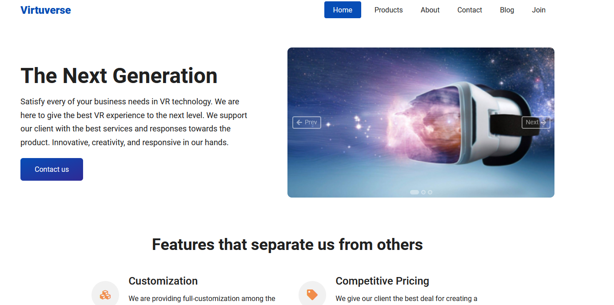
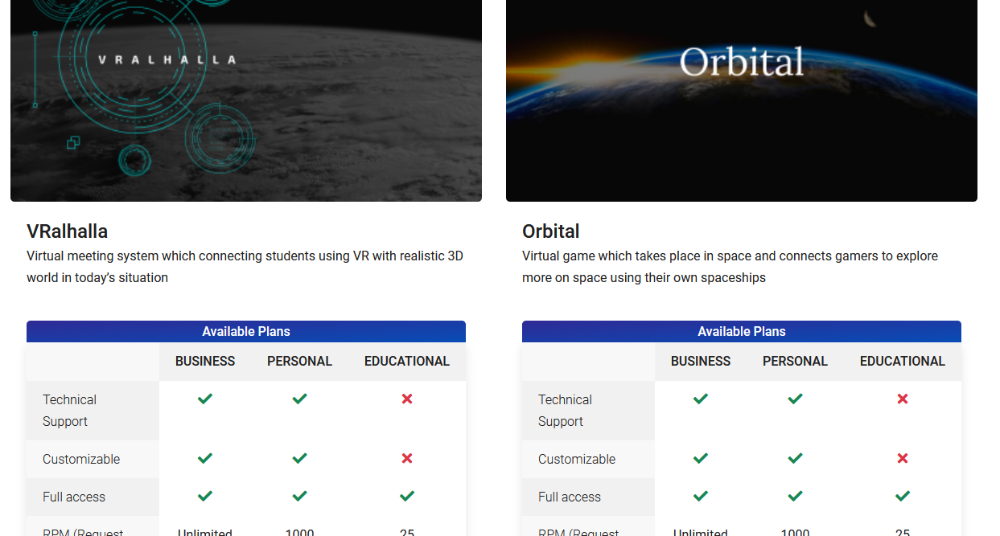

# My First Web Development Project

This is my first web development project, written in JavaScript, HTML, and SASS. I started this project 3 years ago when I first began learning JavaScript.

Landing Page | Product Page
:-------------------------:|:-------------------------:
  | 

## Project Overview

This project served as a major stepping stone in my web development journey. Despite its simplicity, it encapsulates the key concepts of JavaScript, HTML, and SASS, which were fundamental to my future projects.

## Features

The website is built with a responsive design in mind. It is equipped with interactive elements to provide a dynamic user experience. All styling is done using SASS, providing a structured and efficient approach to CSS.

## How to Run

1. Clone this repository to your local machine.
2. Navigate to the project directory in your terminal.
3. If you don't have a live server installed, install it via npm with the command `npm install -g live-server`.
4. Run the command `live-server` in the project directory.
5. Your default browser should now open a new tab with the project running.

## Future Improvements

I plan on revisiting this project in the future to apply more advanced concepts as I continue learning and growing as a developer. Some improvements I've considered include refactoring the JavaScript to use modern ES6 syntax and optimizing the SASS for better performance.

## Feedback and Contributions

I appreciate any feedback on my code and am open to any contributions to improve this project. Please feel free to create a pull request or open an issue if you find any bugs or have any suggestions for improvements.

## License

This project is licensed under the terms of the **MIT license**.